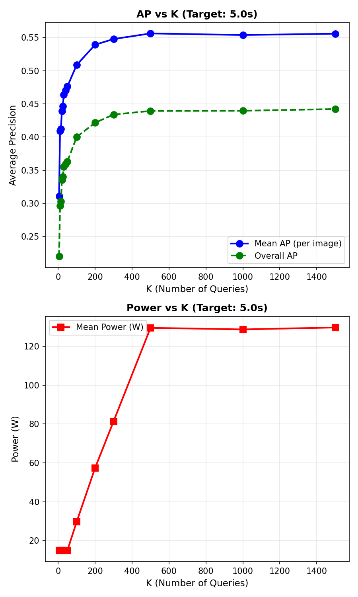
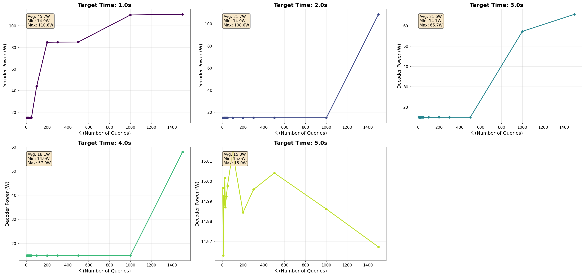
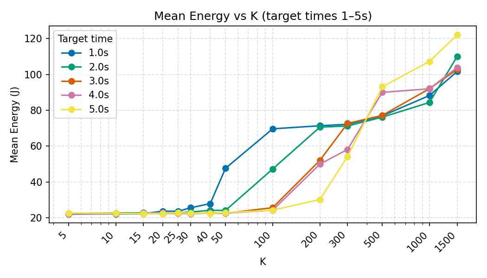
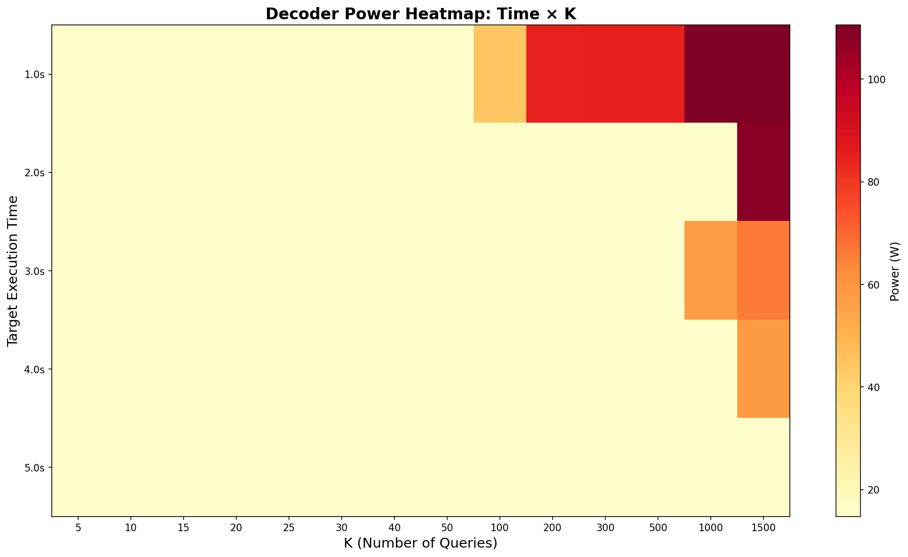
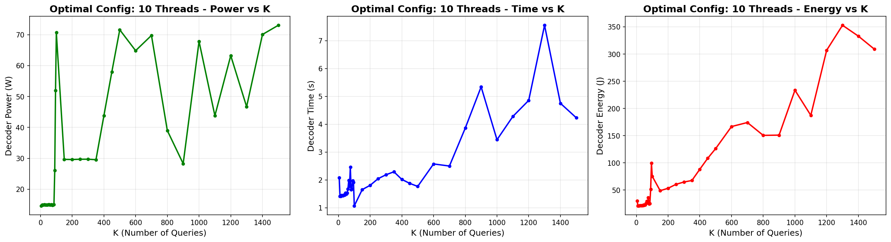
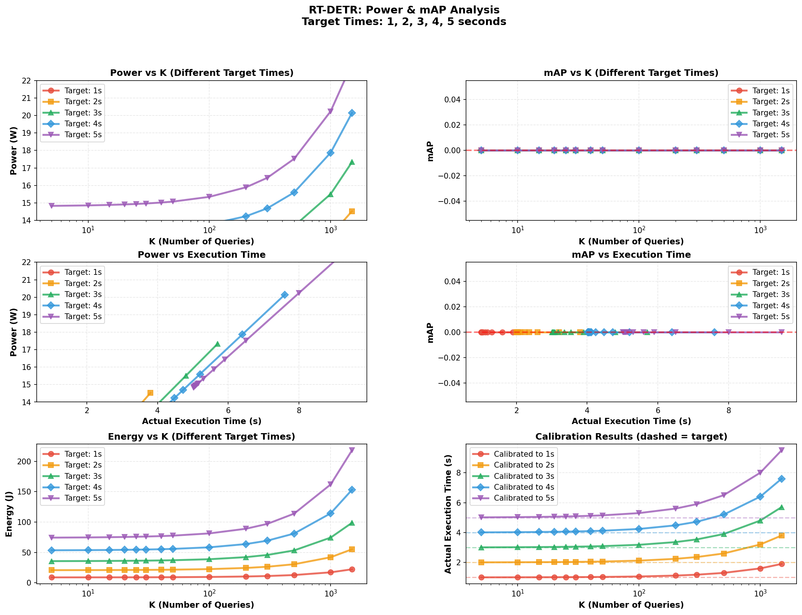

<div align="center">

# ⚡ RT-DETR · Power, Energy & Accuracy Analysis

**A research-grade experimental framework that measures the *power*, *energy*, *latency*
and *mAP* trade-offs of the [RT-DETR](https://github.com/lyuwenyu/RT-DETR) real-time object detector on CPU.**

[](https://github.com/pedro799ab-sketch/rtdetr/actions/workflows/ci.yml)
[](./LICENSE)
[](https://www.python.org/)
[](https://pytorch.org/)
[](https://github.com/lyuwenyu/RT-DETR)
[](./Dockerfile)
[](./CONTRIBUTING.md)

</div>

---

## 🎯 The question this repo answers

> **How does the number of decoder queries `K` and the available compute budget affect
> *power*, *energy*, *latency* and *detection accuracy* on a real CPU?**

The pipeline runs RT-DETR / RT-DETRv2 on COCO, sweeps `K` and CPU thread count, calibrates
to fixed time budgets (1 s → 5 s), logs power/energy from CPU utilization, computes mAP /
AP50 / AP75, and produces publication-style figures.

---

## ✨ Highlights

- 📊 **End-to-end measurement pipeline** — wall time, CPU time, utilization, power (W), energy (J), mAP, AP50, AP75 — all in one CSV.
- 🎚️ **Decoder-query (`K`) sweeps** — see how detection quality and cost scale with the number of object queries.
- ⏱️ **Time-budget calibration** — automatically adapts thread count to hit 1 s / 2 s / 3 s / 4 s / 5 s targets.
- 🔋 **Power minimization** — Pareto search over `(K, num_threads)` to find low-power configs that still hit a target mAP.
- 🧪 **Large-scale validation** — full 1000-image COCO sweep included (`power_map_1000images_*.csv`).
- 🐳 **Containerized** — `Dockerfile` + `docker-compose.yml` for reproducible runs.
- 🖼️ **Plot generators** — every analysis has a matching script that produces a PNG.
- 🍏 **Apple Silicon ready** — validated on `mps`, also runs on `cuda` and `cpu`.

---

## 🖼️ Results gallery

<table>
  <tr>
    <td align="center" width="33%">
      <br/>
      <sub><b>AP & Power vs K</b><br/>summary view</sub>
    </td>
    <td align="center" width="33%">
      <br/>
      <sub><b>Power vs K</b><br/>under 1-5 s time budgets</sub>
    </td>
    <td align="center" width="33%">
      <br/>
      <sub><b>Energy vs K</b><br/>per time budget</sub>
    </td>
  </tr>
  <tr>
    <td align="center">
      <br/>
      <sub><b>Power heatmap</b><br/>(time, K) plane</sub>
    </td>
    <td align="center">
      <br/>
      <sub><b>Pareto frontier</b><br/>min-power config per K</sub>
    </td>
    <td align="center">
      <br/>
      <sub><b>Power · mAP · Energy</b><br/>combined analysis</sub>
    </td>
  </tr>
</table>

📂 Full set of figures (~40 PNGs) is in the repo root. Methodology write-ups:
[`ANALYSIS_SUMMARY.md`](./ANALYSIS_SUMMARY.md) · [`POWER_ANALYSIS_SUMMARY.md`](./POWER_ANALYSIS_SUMMARY.md) ·
[`POWER_MEASUREMENT_REFERENCE.md`](./POWER_MEASUREMENT_REFERENCE.md) · [`VISUALIZATION_GUIDE.md`](./VISUALIZATION_GUIDE.md).

---

## 📈 Sample numbers (1000-image COCO sweep)

| K   |  mAP  | Power (W) | Energy (J) | Time (s) |
| --: | :---: | :-------: | :--------: | :------: |
|   5 | 0.362 |   15.0    |    23.0    |   1.54   |
|  20 | 0.487 |   15.0    |    22.3    |   1.48   |
| 100 | 0.510 |   15.0    |    28.5    |   1.90   |
| 300 | 0.521 |   15.0    |    37.2    |   2.48   |

> Going from `K=5` to `K=300` buys **+16 mAP points** for **+62 % energy** and **+61 % latency**.
> See [`power_map_1000images_summary.csv`](./power_map_1000images_summary.csv) for the full table.

---

## 🚀 Quick start

```bash
# 1. Clone
git clone https://github.com/pedro799ab-sketch/rtdetr.git
cd rtdetr

# 2. Install
python -m venv .venv && source .venv/bin/activate
pip install -r requirements.txt

# 3. Get pretrained weights (not in repo — > 100 MB GitHub limit)
#    Download from upstream RT-DETR releases and place at repo root:
#    - rtdetr_r50vd_6x_coco_from_paddle.pth
#    - rtdetrv2_r50vd_6x_coco_ema.pth

# 4. Run inference on a sample image
python main.py --device mps     # Apple Silicon
python main.py --device cuda    # NVIDIA
python main.py --device cpu
```

`torch` / `torchvision` compatibility:

| torch | torchvision |
| ----: | ----------: |
|   2.4 |        0.19 |
|   2.2 |        0.17 |
|   2.1 |        0.16 |
|   2.0 |        0.15 |

### Or just use Docker

```bash
docker compose up --build
```

---

## 🧪 Reproduce the analyses

```bash
# Power & energy as a function of K
python tools/Val.py --num-images 50 --batch-size 10 \
    --k-values "5,10,20,50,100,200,300"

# Different power profile (limit parallelism)
OMP_NUM_THREADS=2 python tools/Val.py --num-images 50 --batch-size 10 \
    --k-values "5,50,100,200,300"

# Power vs K under fixed time budgets (1-5 s)
python tools/power_vs_K_time.py

# Find minimum-power config that preserves mAP
python tools/minimize_power.py

# Large-scale 1000-image sweep
bash run_1000images_analysis.sh

# Regenerate all plots from CSVs
python tools/generate_analysis_plots.py
python generate_power_map_plots.py
python plot_k_vs_power_map.py
```

---

## 🔬 Methodology (TL;DR)

Power is estimated from CPU utilization, frequency, and TDP:

$$
P = \mathrm{TDP} \cdot U_{\mathrm{CPU}} \cdot \frac{f}{f_{\max}}
\qquad
E = P \cdot t
$$

For each `(K, num_threads, time_budget)` configuration we record:
`wall_time`, `cpu_time`, `cpu_util`, `power_W`, `energy_J`, `mAP`, `AP50`, `AP75`, `AR`.

This yields the **(cost, accuracy)** Pareto front from *real measurements* rather than FLOPs estimates.
Full details in [`POWER_MEASUREMENT_REFERENCE.md`](./POWER_MEASUREMENT_REFERENCE.md).

---

## 🗂️ Repository layout

```
.
├── configs/                  # RT-DETR / RT-DETRv2 model configs (YAML)
├── src/                      # RT-DETR source (model, data, solver, zoo) – upstream base
├── tools/                    # 🔧 Custom analysis & evaluation scripts
│   ├── Val.py                #   COCO eval with K sweep + power logging
│   ├── Val_per5images.py     #   Per-image / per-5-images granular eval
│   ├── val_with_ap.py        #   mAP / AP50 / AP75 evaluation pipeline
│   ├── val_subset_k_analysis.py
│   ├── minimize_power.py     #   (K, threads) Pareto search for min power
│   ├── power_vs_K_time.py    #   Power vs K under fixed time budgets
│   ├── power_vs_time_analysis.py
│   ├── generate_analysis_plots.py
│   ├── simple_map.py
│   ├── run_profile.py        #   CPU/perf profiler wrapper
│   ├── test_power.py
│   ├── train.py
│   ├── export_onnx.py / export_trt.py / onnx2trt.sh
│   └── AP.py / convert_csv.py
├── min_power_map_sweep.py    # Top-level sweep entry points
├── optimal_cpu_per_k.py
├── power_map_per5images.py
├── compute_map_only.py
├── embed_photos.py
├── generate_power_map_plots.py
├── plot_k_vs_power_map.py
├── quick_plot_3images.py
├── main.py                   # Quick inference demo
├── Dockerfile, docker-compose.yml
├── requirements.txt
└── *.csv / *.md / *.png      # Results, plots and methodology write-ups
```

---

## 🤝 Contributing

Bug reports, new analyses and docs improvements are very welcome — see
[`CONTRIBUTING.md`](./CONTRIBUTING.md). Issue & PR templates are pre-filled
under `.github/`.

---

## 📜 License & credits

- My contributions — analysis pipeline, scripts under `tools/`, sweep drivers at the repo root,
  all `*_ANALYSIS*.md` / `*_REFERENCE*.md` / `VISUALIZATION_GUIDE.md` docs and result CSVs — are
  released under the **MIT License** (see [`LICENSE`](./LICENSE)).
- The underlying **RT-DETR / RT-DETRv2** model code in `src/`, `configs/` and `references/` is
  the work of Lyu Wenyu et al. and remains under its original **Apache 2.0** license.
  Upstream repo: <https://github.com/lyuwenyu/RT-DETR>.

If you use this work, please cite it (see [`CITATION.cff`](./CITATION.cff)) and the original
RT-DETR paper:

```bibtex
@article{zhao2024detrs,
  title   = {DETRs Beat YOLOs on Real-time Object Detection},
  author  = {Zhao, Yian and Lv, Wenyu and others},
  journal = {arXiv preprint arXiv:2304.08069},
  year    = {2024}
}
```

---

## 👤 Author

**Ahmed Badr** — building efficient computer-vision systems and energy-aware ML.

> If you're hiring for ML / Computer Vision / Efficient AI roles, feel free to reach out. 🙂

<div align="center">
  <sub>⭐ If this project is useful to you, please consider giving it a star — it really helps.</sub>
</div>
